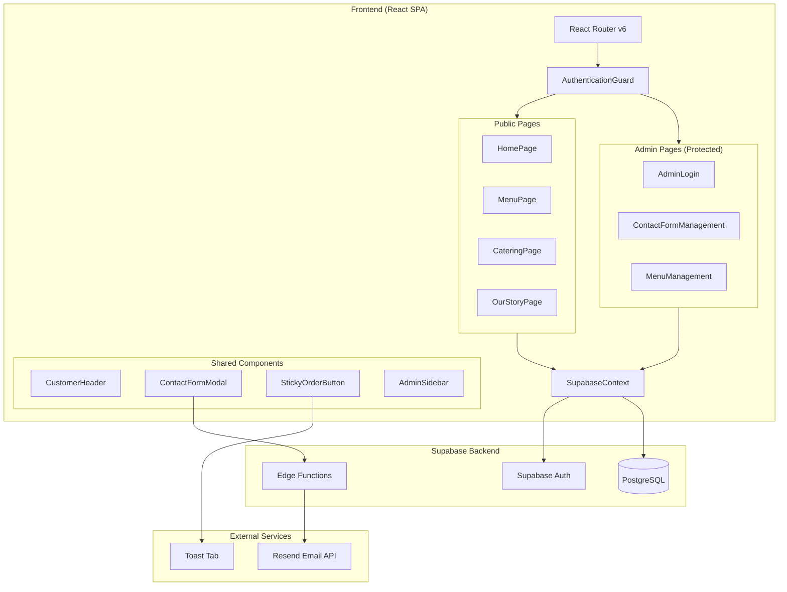

# Architecture Overview

## System Diagram

## Component Descriptions

### SupabaseContext
- **Purpose**: Centralized data layer providing all Supabase operations to the component tree
- **Location**: `src/context/SupabaseContext.jsx`
- **Key responsibilities**: Authentication (sign in/out, admin status checks), menu CRUD (categories, items), catering services and requests, contact inquiry management, company settings

### AuthenticationGuard
- **Purpose**: Route-level access control for admin pages
- **Location**: `src/components/ui/AuthenticationGuard.jsx`
- **Key responsibilities**: Wraps admin routes, checks `admin_users` table for active admin status, redirects unauthorized users, provides `AuthProvider` context

### CustomerHeader
- **Purpose**: Shared navigation header across all public pages
- **Location**: `src/components/ui/CustomerHeader.jsx`
- **Key responsibilities**: Site navigation, branding display, responsive mobile menu

### StickyOrderButton
- **Purpose**: Persistent call-to-action for online ordering
- **Location**: `src/components/ui/StickyOrderButton.jsx`
- **Key responsibilities**: Fixed-position button that opens Toast Tab ordering in a new tab

### ContactFormModal
- **Purpose**: Reusable contact form overlay
- **Location**: `src/components/ui/ContactFormModal.jsx`
- **Key responsibilities**: Collects inquiry data (name, email, phone, subject, message, type), submits to Supabase `contact_inquiries` table, triggers email notification edge function

## Data Flow

1. **Menu Display**: `MenuPage` calls `SupabaseContext.getMenuCategories()` and `getMenuItems()` → Supabase queries `menu_categories` and `menu_items` tables (RLS: public read for active items) → Data renders in filterable grid with dietary tags
2. **Contact Submission**: User fills `ContactFormModal` → `submitContactInquiry()` inserts into `contact_inquiries` → Supabase Edge Function `send-contact-email` fires → Resend API delivers email to restaurant
3. **Catering Request**: User completes 3-step wizard (service → menu → details) → `submitCateringRequest()` inserts into `catering_requests` with selected service, menu items, and event details
4. **Admin Flow**: Admin authenticates via `AdminLogin` → `SupabaseContext.signIn()` → `checkAdminStatus()` verifies `admin_users` entry → Protected routes unlock → Admin can view/filter/respond to inquiries

## External Integrations

| Service | Purpose | Integration Point |
|---------|---------|-------------------|
| Supabase | Database, Auth, Edge Functions | `src/lib/supabaseClient.js` via `@supabase/supabase-js` |
| Toast Tab | Online ordering system | Direct URL link from `StickyOrderButton` |
| Resend | Transactional email delivery | `supabase/functions/send-contact-email/index.ts` |

## Key Architectural Decisions

### Centralized SupabaseContext over per-page data fetching
- **Context**: Every page needs access to Supabase data (menu, settings, auth)
- **Decision**: Single `SupabaseContext` provider wraps the entire app, exposing all data operations
- **Rationale**: Avoids duplicating Supabase client setup across pages, provides consistent error handling via `handleApiError`, and centralizes auth state management

### Supabase Row-Level Security over middleware auth
- **Context**: Need to protect admin operations while keeping menu/settings publicly readable
- **Decision**: RLS policies on every table with an `is_admin()` helper function
- **Rationale**: Security is enforced at the database level regardless of client behavior, public users can read active menu items and settings without authentication, and admin writes require authenticated admin role

### Static Toast Tab link over embedded ordering
- **Context**: Online ordering capability needed
- **Decision**: Simple link to Toast Tab's hosted ordering page rather than embedding or building custom ordering
- **Rationale**: Leverages Toast Tab's existing POS integration, payment processing, and order management — avoids rebuilding complex ordering infrastructure

### Edge Functions for email over client-side email
- **Context**: Contact form submissions need to notify the restaurant
- **Decision**: Supabase Edge Function calls Resend API server-side
- **Rationale**: Keeps API keys secure (not exposed to browser), allows email formatting server-side, and provides a reliable delivery path independent of client behavior
