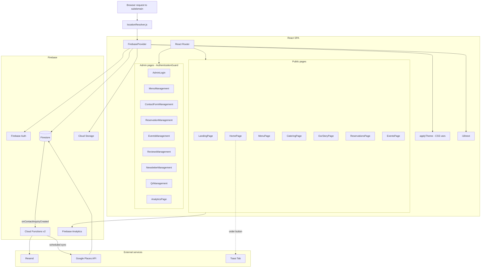

# Architecture

## System Diagram

```mermaid
flowchart TD
    Browser[Browser request to subdomain]
    Resolver[locationResolver.js]
    Browser --> Resolver

    subgraph Client["React SPA"]
        Router[React Router]
        Provider[FirebaseProvider]
        Theme[applyTheme - CSS vars]
        I18n[i18next]

        subgraph Public["Public pages"]
            Landing[LandingPage]
            Home[HomePage]
            Menu[MenuPage]
            Catering[CateringPage]
            Story[OurStoryPage]
            Reservations[ReservationsPage]
            Events[EventsPage]
        end

        subgraph Admin["Admin pages - AuthenticationGuard"]
            Login[AdminLogin]
            MenuMgmt[MenuManagement]
            ContactMgmt[ContactFormManagement]
            ResMgmt[ReservationManagement]
            EventsMgmt[EventsManagement]
            ReviewsMgmt[ReviewsManagement]
            NewsMgmt[NewsletterManagement]
            QrMgmt[QrManagement]
            AnalyticsPage[AnalyticsPage]
        end
    end

    Resolver --> Provider
    Provider --> Theme
    Provider --> I18n
    Router --> Public
    Router --> Admin

    subgraph Firebase["Firebase"]
        Auth[Firebase Auth]
        FS[(Firestore)]
        CF[Cloud Functions v2]
        Storage[Cloud Storage]
        FA[Firebase Analytics]
    end

    Provider --> Auth
    Provider --> FS
    Provider --> Storage

    subgraph External["External services"]
        Resend[Resend]
        Places[Google Places API]
        Toast[Toast Tab]
    end

    FS -- onContactInquiryCreated --> CF
    CF --> Resend
    CF -- scheduled sync --> Places
    Places --> FS

    Home -.order button.-> Toast
    Public --> FA
```

## Component Descriptions

### locationResolver
- **Purpose**: Maps the current hostname to a `locationId` for multi-tenancy
- **Location**: `src/lib/locationResolver.js`
- **Key responsibilities**: Reads `window.location.hostname`, returns the subdomain (e.g. `tela`) in production or the `?location=` query param on localhost; returns `null` to render the cross-tenant landing page

### FirebaseProvider / FirebaseContext
- **Purpose**: Single React context that owns all Firestore reads/writes, auth state, brand and location settings, and theme application
- **Location**: `src/context/FirebaseContext.jsx`
- **Key responsibilities**: Resolves `locationId` once on mount, loads `settings/config` (brand) and `locations/{id}/settings/config` (per-location), merges them one level deep into `effectiveSettings`, loads per-location translation docs into i18next, listens for auth changes and verifies admin status against `adminUsers/{uid}`, exposes CRUD methods for every collection

### AuthenticationGuard
- **Purpose**: Route-level access control for admin pages
- **Location**: `src/components/ui/AuthenticationGuard.jsx`
- **Key responsibilities**: Redirects unauthenticated users and non-admins; combined with Firestore rules, admin role is verified both client- and server-side

### Theme system
- **Purpose**: Runtime restaurant theming without rebuild
- **Location**: `src/lib/theme.js`
- **Key responsibilities**: Defines five preset palettes; `applyTheme(theme)` writes each color to a CSS custom property on `:root`; Tailwind classes reference the variables

### Demo mode
- **Purpose**: Render a fully-populated experience without touching Firebase
- **Location**: `src/hooks/useDemoMode.js`, `src/data/demoTela.js`
- **Key responsibilities**: When `?demo=tela` is present, components consume in-memory fixtures (settings, menu, reservations, events, reviews) instead of Firestore — useful for previews and screenshots

### Cloud Functions
- **Purpose**: Server-side work that the browser cannot or should not do
- **Location**: `functions/index.js`
- **Key responsibilities**:
  - `onContactInquiryCreated` — Firestore trigger that formats and sends email via Resend
  - `syncGoogleReviews` — callable function that pulls Google Places reviews for a location
  - Scheduled reviews refresh via `onSchedule`
  - HMAC-signed unsubscribe tokens for newsletter links

## Data Flow

### Public visit on `tela.restauranthub.com`
1. `locationResolver` returns `"tela"`
2. `FirebaseProvider` loads `settings/config` (brand defaults) and `locations/tela/settings/config` (Tela overrides)
3. The two are merged one level deep; theme is applied via CSS variables; available translations are registered in i18next
4. Menu page queries `menuItems` (base) and `locations/tela/menuItemOverrides` and merges them so a single base item can be priced or hidden per location

### Contact submission
1. User submits `ContactFormModal`; `submitContactInquiry` writes to `contactInquiries`
2. `onContactInquiryCreated` Cloud Function fires, reads `settings/config` for the recipient email and restaurant name, and sends HTML email via Resend
3. The function writes `emailNotificationSent: true` (or the failure message) back onto the inquiry document

### Reviews sync
1. Admin enters a Google Places ID in location settings
2. Scheduled function (or callable) pulls reviews for each configured location
3. Reviews are stored per location and surfaced on the home page and admin Reviews Management dashboard

## External Integrations

| Service | Purpose | Notes |
|---------|---------|-------|
| Firebase | Auth, Firestore, Functions, Storage, Analytics | Single project hosts all tenants |
| Resend | Transactional email for contact inquiries | API key stored as Functions secret |
| Google Places API | Reviews sync per location | API key stored as Functions secret; place ID per location |
| Toast Tab | External online ordering | Linked, not embedded — opens in new tab |

## Key Architectural Decisions

### Subdomain-based multi-tenancy over per-restaurant deploys
- **Context**: A template intended to serve many restaurants without forking the codebase per tenant
- **Decision**: One deployment; `locationResolver.js` extracts the subdomain and the rest of the app keys all queries off `locationId`
- **Rationale**: Adding a tenant becomes a Firestore document + DNS record instead of a build/deploy cycle. Tenants share menu base data but can override per-location.

### Brand defaults plus per-location overrides
- **Context**: Most restaurants share 90% of their config (hero copy, hours format, contact UI) with brand-level defaults, but need a few overrides (theme, address, specific menu prices)
- **Decision**: Two Firestore documents per page load — `settings/config` and `locations/{id}/settings/config` — merged one level deep client-side
- **Rationale**: Avoids duplicating defaults across locations and lets a tenant override exactly the keys they need without rewriting full config

### Runtime CSS-variable theming over Tailwind theme rebuilds
- **Context**: Each tenant needs its own brand colors; rebuilding Tailwind per tenant is not viable
- **Decision**: `applyTheme()` writes color presets to CSS custom properties on `:root`; Tailwind utilities reference those variables
- **Rationale**: Theme switching is instant, works from the admin panel, and shares a single CSS bundle across all tenants

### Firestore security rules as the authorization layer
- **Context**: Public pages need to read menus and settings; admin operations must be locked down per location
- **Decision**: Rules in `firestore.rules` define `isActiveAdmin()` and `isAdminForLocation()` helpers; super-admins access all locations, regular admins are scoped via `locationIds` on their `adminUsers` doc
- **Rationale**: Authorization is enforced at the database regardless of client behavior; the client's `AuthenticationGuard` is a UX shortcut, not the security boundary

### Email and reviews behind Cloud Functions
- **Context**: Resend and Google Places need secret API keys that cannot ship to the browser
- **Decision**: Firestore trigger for contact email; callable + scheduled function for reviews sync
- **Rationale**: Secrets stay in Functions config; email/reviews flow continues to work even if the browser tab closes after submission
