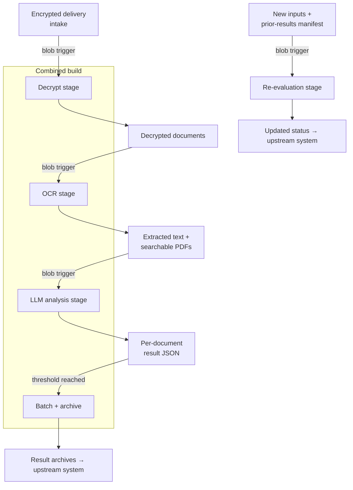

# Architecture

## System Diagram

## Component Descriptions

### Decrypt stage
- **Purpose**: Unwraps layered/encrypted document deliveries into plain PDFs.
- **Key responsibilities**: Blob-triggered extraction with `pyzipper`, writing decrypted output to the next stage's storage.

### OCR stage
- **Purpose**: Converts PDFs into machine-readable text and searchable PDFs.
- **Key responsibilities**: PyMuPDF text extraction with an optional OCRmyPDF/Tesseract fallback for image-only pages; the fallback is feature-flagged so environments without Tesseract still run.

### LLM analysis stage
- **Purpose**: Produces a structured assessment per document.
- **Key responsibilities**: Calls Azure OpenAI, parses the response into normalized JSON, and writes one result file per document.

### Batch / archive stage
- **Purpose**: Bundles individual result files into archives once a threshold is reached.
- **Key responsibilities**: Threshold-based archive batching to reduce downstream transfer overhead.

### Re-evaluation stage
- **Purpose**: Determines whether new inputs change an earlier result.
- **Key responsibilities**: Parses a manifest mapping earlier results to inputs, extracts text from PDFs/XML, runs an LLM comparison, and emits an updated per-item status.

## Data Flow

1. An encrypted delivery lands in intake storage and fires the decrypt trigger.
2. Decrypted PDFs are written to the next stage's storage, which triggers OCR.
3. OCR output (text + searchable PDFs) triggers the LLM analysis stage.
4. Each document yields a normalized result JSON; once enough accumulate, they are batched into an archive and handed back to the upstream system.
5. Separately, a re-evaluation delivery (new inputs + a prior-results manifest) triggers a workflow that reports an updated status per item.

## External Integrations

| Service | Purpose | Notes |
|---------|---------|-------|
| Azure Blob Storage | Stage-to-stage handoff and durable intermediate state | Each pipeline boundary is a storage location; triggers fire on new blobs |
| Azure OpenAI | Document analysis and re-evaluation | Calls wrapped with retry + rate-limit handling |
| Upstream system | Source of deliveries and destination for results | Credentials supplied via environment variables |

## Key Architectural Decisions

### Blob-triggered stages over a single synchronous service
- **Context**: Document deliveries arrive in unpredictable bursts and each stage (decrypt, OCR, LLM) has very different latency and failure characteristics.
- **Decision**: Decouple every stage behind its own blob-storage location and trigger.
- **Rationale**: Each stage scales and retries independently, intermediate artifacts are inspectable, and a failure in one stage doesn't lose upstream work. The alternative — one long-running request — would couple unrelated failure modes and risk function timeouts on large batches.

### Optional, feature-flagged OCR fallback
- **Context**: True OCR (Tesseract) needs a system binary that isn't always present, but many documents already contain an embedded text layer.
- **Decision**: Default to PyMuPDF text extraction and treat OCRmyPDF/Tesseract as an optional fallback controlled by a feature flag.
- **Rationale**: The pipeline stays deployable in constrained environments and avoids paying OCR cost on documents that don't need it, while still handling image-only PDFs where the binary is available.

### Retry wrapper around LLM calls
- **Context**: Hosted LLM endpoints return transient rate-limit errors under load.
- **Decision**: Wrap every Azure OpenAI call in a bounded retry loop with explicit rate-limit detection and backoff.
- **Rationale**: Batches complete reliably without manual reruns; failures surface only after retries are exhausted rather than on the first transient error.

### Monorepo consolidated by pipeline stage
- **Context**: The system had fragmented into several repositories — including earlier standalone versions of stages that were later merged into one combined build, plus a stub and an archived predecessor.
- **Decision**: Consolidate into one repository organized by pipeline stage, with superseded code quarantined and the live combined build clearly marked.
- **Rationale**: The data flow is now legible end-to-end in one place, duplicate/dead code is quarantined rather than deleted (preserving reference value), and there's a single source of truth for deployment.
