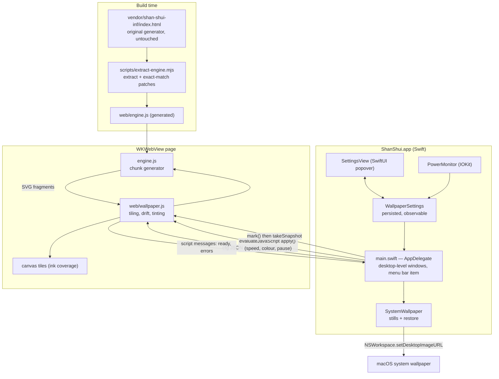

# Architecture

## System Diagram

## Component Descriptions

### Engine extraction
- **Purpose**: Turn the original single-page generator into a script the wallpaper can drive, without editing the vendored file.
- **Location**: `scripts/extract-engine.mjs`
- **Key responsibilities**: pull the generator's script blocks out of the upstream page; wrap them so their heavy console logging is silenced locally; apply a short list of exact-match rewrites that route composition constants through a `TUNE` object; fail the build if any rewrite does not match exactly once.

### Wallpaper page
- **Purpose**: Render the generator's output as a smooth, endless strip.
- **Location**: `web/wallpaper.js`, `web/index.html`
- **Key responsibilities**: ask the engine for terrain ahead of the view; measure each generated element's horizontal extent; rasterize 512-unit tiles to canvases; tint tiles with the ink colour; move the strip with a transform animation; pause when hidden or starved of tiles; expose `apply()` and `mark()` to the host.

### Host app
- **Purpose**: Put the page behind the desktop icons and own everything that needs the OS.
- **Location**: `app/main.swift`
- **Key responsibilities**: one borderless, click-through window per screen at the desktop window level; load the page with settings in the URL; push live settings; menu bar item and popover; snapshot scheduling.

### Settings
- **Purpose**: A single source of truth for what the page is told.
- **Location**: `app/WallpaperSettings.swift`, `app/SettingsView.swift`
- **Key responsibilities**: persist values in user defaults; separate "live" settings (applied to the running page) from "terrain" settings (require a repaint); serialize both to JSON.

### System wallpaper sync
- **Purpose**: Hide the system wallpaper that macOS shows during a swipe back from a full-screen app.
- **Location**: `app/SystemWallpaper.swift`
- **Key responsibilities**: encode a snapshot off the main thread, set it as the screen's wallpaper, remember the user's original once, restore it on quit.

### Power monitor and icon
- **Location**: `app/Power.swift`, `app/Glyph.swift`
- **Key responsibilities**: report battery/AC changes through an IOKit run loop source; draw the pavilion mark in code for both the menu bar template image and the app icon set.

## Data Flow

1. On launch the host creates a window per screen and loads the page with a `cfg` JSON parameter (seed, terrain, colours, speed).
2. The page seeds its random generator, sets the engine's tunables, and asks the engine for terrain covering the first tile plus a margin.
3. Each generated element is measured once from its polyline points. Elements overlapping the tile are concatenated into an SVG whose filter converts darkness to alpha, and the SVG is drawn to a canvas.
4. The canvas is filled with the ink colour using `source-in` compositing and appended to the strip.
5. Once the screen is covered, the strip starts a linear transform animation. A one-second timer renders the next tile ahead and removes tiles that have scrolled off.
6. Slider changes go either through `apply()` (speed, colour, pause) or a debounced page reload (terrain).
7. Once a minute while visible, the host asks the page to `mark()` its position, snapshots the view, and sets the snapshot as the system wallpaper. When the page is hidden it rewinds to the mark.

## External Integrations

| Service | Purpose | Notes |
|---------|---------|-------|
| Apple notary service | Notarization of the app and disk image | API key in CI; run once per artifact, each stapled |
| GitHub Actions / Releases | Build on push, publish on tag | macOS runners; certificate imported into a throwaway keychain |

## Key Architectural Decisions

### Rasterized tiles moved by the compositor, not a live SVG
- **Context**: The generator emits tens of thousands of polylines and the original page rebuilds the whole SVG on every scroll step. A wallpaper has to move continuously for hours.
- **Decision**: Rasterize the scene once into canvas tiles and move the strip with a transform animation.
- **Rationale**: Animating the SVG viewBox would re-rasterize every path every frame. A requestAnimationFrame loop would wake the page 60–120 times a second for nothing. A transform animation is handed to the compositor, so steady-state scrolling runs no script at all and survives the occasional 150 ms tile render without a visible hitch.

### Tiles store ink coverage, not colour
- **Context**: Ink and paper colour should be changeable live, including light ink on dark paper, which the original's multiply blending cannot express.
- **Decision**: An SVG filter flattens each tile onto white and maps luminance to alpha. The canvas then holds pure coverage and is coloured with a single `source-in` fill.
- **Rationale**: Re-rendering tiles on a colour change costs seconds and needs the source geometry kept in memory. CSS blend modes cost a full-screen blend every frame and cannot go light-on-dark. With coverage tiles, recolouring is one fill per tile, and normal alpha compositing replaces the blend mode entirely.

### Patch the generator at build time by exact string match
- **Context**: Terrain controls need access to constants hardcoded inside the generator, and the generator should stay credited and recognisably unmodified.
- **Decision**: Keep the upstream file byte-for-byte in `vendor/` and apply a short, reviewed list of exact-match rewrites when extracting it.
- **Rationale**: Forking the file would bury a handful of one-line changes in 4,000 lines and blur what is original. Runtime monkey-patching cannot reach constants inside closures. Exact-match rewrites are explicit, and the build fails loudly if upstream ever changes underneath them.

### Replace the generator's random number source
- **Context**: The original generator squares values near 10¹², which exceeds what a double represents exactly, so its sequence degrades into short cycles on long runs.
- **Decision**: Override `Math.random` with a seeded sfc32 before any terrain is generated.
- **Rationale**: A single page view never runs long enough to notice; a wallpaper running for days would. The override keeps seeds reproducible and leaves the vendored code untouched.

### Match the system wallpaper to hide the full-screen transition
- **Context**: macOS does not composite a desktop-level window during the swipe back from a full-screen space, so the real wallpaper shows for the length of the animation. Window collection behaviours do not change this.
- **Decision**: Keep the system wallpaper set to a recent still, and rewind the drift to that still's position whenever the page is hidden.
- **Rationale**: Because the drift is paused while hidden and resumes from the marked position, the still and the live window show the same frame, so the handover is invisible. The cost is one JPEG a minute and a changed system setting, so it is a toggle and the original wallpaper is restored on quit, including on SIGTERM.

### Split settings into live and terrain
- **Context**: Some settings can change under a running scene; others change what the generator would have produced.
- **Decision**: Live settings are pushed with `evaluateJavaScript`; terrain settings reload the page with the same seed after a half-second debounce.
- **Rationale**: Applying terrain changes only to scenery not yet generated would take minutes to scroll into view, which makes a slider feel broken. A quick repaint gives immediate feedback.
