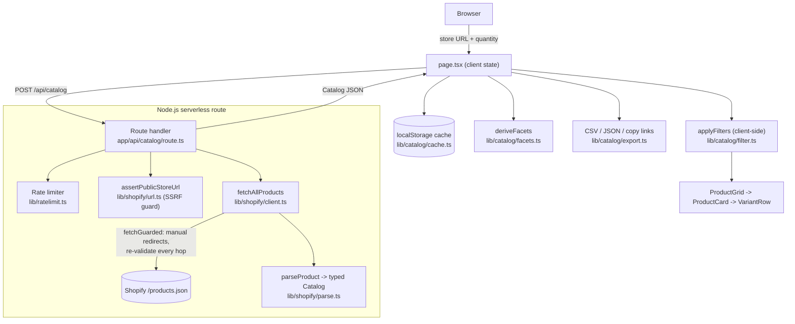

# Architecture

## System Diagram

## Component Descriptions

### Catalog API route
- **Purpose**: The only server-side surface — fetches a store's public product feed that the browser can't read itself (no CORS header).
- **Location**: `app/api/catalog/route.ts`
- **Key responsibilities**: per-IP rate limiting, SSRF validation of the submitted URL, invoking the paginating fetch client, and mapping internal errors to stable client-facing error codes.

### Shopify fetch client
- **Purpose**: Retrieve and normalize a complete catalog from `/products.json`.
- **Location**: `lib/shopify/client.ts`, `lib/shopify/parse.ts`
- **Key responsibilities**: page-based pagination with cross-page de-duplication; redirect following that re-validates every hop; converting raw JSON into a typed `Catalog` with `/cart/add` permalinks per variant.

### URL guard
- **Purpose**: Prevent the route from being used as a server-side request forgery (SSRF) proxy into private infrastructure.
- **Location**: `lib/shopify/url.ts`
- **Key responsibilities**: normalize input, restrict scheme/port, resolve DNS, and reject any hostname whose resolved IPs fall in private, loopback, link-local, or carrier-grade-NAT ranges (IPv4 and IPv6, including IPv4-mapped addresses).

### Client UI + state
- **Purpose**: Hold the catalog in memory and drive all interaction without further network calls.
- **Location**: `app/page.tsx`, `components/*`
- **Key responsibilities**: orchestrate fetch/cache/restore, derive filter facets, apply filters/sort, window large result sets ("load more"), and render expandable per-product variant cards.

### Catalog utilities
- **Purpose**: Pure, unit-tested logic for facets, filtering, export, and persistence.
- **Location**: `lib/catalog/{facets,filter,export,cache}.ts`
- **Key responsibilities**: derive vendor/type/tag/price facets; filter and sort products and their variants; serialize to injection-safe CSV or JSON; persist and restore the session in `localStorage`.

## Data Flow

1. The user enters a store URL and a per-link quantity and submits the form.
2. The client `POST`s to `/api/catalog`. The route rate-limits the caller, validates the URL against the SSRF guard, then paginates the store's `/products.json` until a short or repeated page, de-duplicating by product id.
3. Raw products are parsed into a typed catalog where each variant carries a precomputed `…/cart/add?id=<variant>&quantity=<n>` permalink.
4. The catalog returns to the browser and is cached in `localStorage` (with the store URL, quantity, and filter state).
5. The UI derives facets and applies search/availability/vendor/type/tag/price filters and sorting entirely client-side, rendering a windowed grid of expandable cards.
6. Export and copy actions operate on the current filtered view, in the browser.

## External Integrations

| Service | Purpose | Notes |
|---------|---------|-------|
| Shopify `/products.json` | Source of truth for a store's products and variants | Public, unauthenticated, no CORS header (hence the server-side proxy); paginates with `?page=N`, 250 items max per page |
| Vercel | Hosting + serverless execution | Node.js runtime; the route sets a 60s max duration for large catalogs |

## Key Architectural Decisions

### Server-side fetch, client-side everything else
- **Context**: `/products.json` returns no `Access-Control-Allow-Origin` header, so the browser cannot read it directly; but filtering and export are pure data transforms.
- **Decision**: A single thin serverless route fetches and normalizes the catalog; all filtering, sorting, faceting, and export run in the browser against the in-memory catalog.
- **Rationale**: Keeps the server stateless and cheap (one request per build), and makes every subsequent interaction instant with no round-trips. The alternative — a query API that filters server-side — would add latency and backend state for no benefit, since a single store's catalog fits comfortably in memory.

### Page-based pagination with cross-page de-duplication
- **Context**: The catalog initially appeared to contain thousands of duplicate products.
- **Decision**: Paginate with `?page=N` and de-duplicate by product id across pages, stopping when a page is short or adds nothing new.
- **Rationale**: The public storefront feed ignores `since_id` (an Admin-API parameter), so `since_id`-based paging silently re-returned page one on every request. Page-based paging is the contract the public endpoint actually honors; the de-dup guard additionally protects against stores that ignore pagination entirely, so a real ~600-product store no longer inflates into thousands of rows.

### Defense-in-depth SSRF guard
- **Context**: A route that fetches arbitrary user-supplied URLs is a classic SSRF vector into cloud metadata endpoints and internal services.
- **Decision**: Validate scheme and port, resolve DNS and reject private/loopback/link-local/CGNAT ranges, and re-run the same validation on every redirect hop while following redirects manually.
- **Rationale**: A single up-front check is insufficient because a public host can 3xx-redirect to an internal address. Re-validating each hop closes that bypass. (A residual DNS-rebinding TOCTOU between validation and fetch is documented and accepted for a read-only catalog tool.)

### Persist the session in `localStorage`, not a backend
- **Context**: Rebuilding a whole store on every page refresh is wasteful.
- **Decision**: Cache the built catalog, store URL, quantity, and filter state in `localStorage` (catalog and view under separate keys), restored on mount with a TTL; "Build links" always refetches fresh.
- **Rationale**: Avoids a refetch with zero backend state. Splitting the large catalog from the small filter state means typing in a filter never re-serializes megabytes. The restore runs in a mount effect (not during render) to stay SSR-safe and avoid a hydration mismatch, and every storage call degrades gracefully if quota is exceeded or storage is disabled.

### One card per color, with the colorway surfaced
- **Context**: Shopify lists each color as a separate product (a base item can appear a dozen-plus times), which reads as duplication.
- **Decision**: Keep one card per product so every add-to-cart link maps 1:1 to a real product page, but split the title into base name + colorway and display the colorway as a highlighted tag.
- **Rationale**: Merging colorways heuristically (e.g. by title prefix) risks grouping genuinely distinct SKUs and breaks the 1:1 link guarantee that's the whole point of the tool. Labeling the differentiator solves the perceived-duplication problem without that risk.
