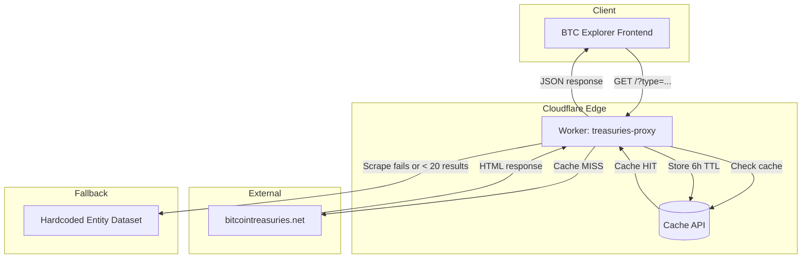

# Architecture Overview

## System Diagram

## Component Descriptions

### Worker Entry Point (`fetch` handler)
- **Purpose**: Routes incoming requests, manages cache, orchestrates scraping and response
- **Location**: `src/index.js:561-687`
- **Key responsibilities**:
  - CORS preflight handling with exact-match origin whitelisting (unknown origins denied)
  - Route validation: 404 for unknown routes, 405 for non-GET/OPTIONS methods
  - OPTIONS scoped to known routes only
  - Type parameter validation against known set (prevents cache key poisoning)
  - Cache bypass protected by `REFRESH_SECRET` env var
  - Cache lookup and population via Cloudflare Cache API
  - Delegating to scraping functions
  - Merging scraped data with fallback dataset
  - Filtering and sorting entities by type/BTC holdings

### Homepage Scraper (`scrapeHomepage`)
- **Purpose**: Scrapes the main BitcoinTreasuries.net homepage for the Top 100 holders table
- **Location**: `src/index.js:90-218`
- **Key responsibilities**:
  - Fetches HTML with browser-like headers to avoid blocking
  - Parses `<table>` rows to extract entity name, ticker, country, BTC amount
  - Also extracts data from treemap chart text
  - Deduplicates by entity name

### Entity Classification System
- **Purpose**: Categorizes and validates scraped entities
- **Location**: `src/index.js:220-434`
- **Key responsibilities**:
  - `categorizeCompany` - keyword-based classification into ~12 categories with tightened matching (e.g., `block, inc` not just `block`)
  - `determineEntityType` - determines top-level type (public, private, etf, government, defi)
  - `mapCountryCode` - normalizes country slugs to ISO 2-letter codes using a ~45 country lookup table
  - `cleanCompanyName` - strips extra whitespace and trailing commas
  - All pure functions are exported for unit testing

### Comprehensive Fallback Dataset
- **Purpose**: Curated dataset of ~100 entities as safety net
- **Location**: `src/index.js:436-557`
- **Key responsibilities**:
  - Provides data when scraping fails entirely
  - Supplements scraped data with hard-to-scrape entity types (ETFs, governments, DeFi)

### Retry & Response Utilities
- **Purpose**: HTTP resilience and CORS-aware response helpers
- **Location**: `src/index.js:14-80`
- **Key responsibilities**:
  - `fetchWithRetries` - exponential backoff (3 attempts, 500ms base delay, 10s timeout per request), status-aware retries (retries 429/5xx, fast-fails on 403/404)
  - `getCorsHeaders` / `withCors` - exact-match origin whitelisting (unknown origins denied) with `Vary: Origin` header
  - `jsonResponse` / `emptyResponse` - response constructors with caching headers

## Data Flow

1. **Request arrives** at the Cloudflare edge; method check rejects non-GET/OPTIONS with 405
2. **Route check** - OPTIONS returns 204 only on known routes; `/health` returns status; unknown paths return 404; only `/` proceeds
3. **Input validation** - `type` param validated against `VALID_TYPES` set; `refresh` param checked against `REFRESH_SECRET` env var
4. **Cache check** - looks for a cached response keyed by validated entity type filter
5. **On cache miss** - `scrapeHomepage()` fetches and parses the BitcoinTreasuries.net HTML (10s timeout per attempt, 3 retries with status-aware retry logic)
6. **Fallback merge** - if scraping yields < 20 entities, uses full fallback; otherwise merges missing entities from fallback
7. **Validation** - filters out garbage entries (no ASCII letters in name, pure-numeric tickers, zero BTC)
8. **Type filter** - optionally filters by validated `?type=` query parameter
9. **Sort** - entities sorted by BTC holdings descending
10. **Cache store** - response cached for 6 hours with 24-hour stale-if-error
11. **Response** - JSON returned with `x-cache: hit/miss` header

## External Integrations

| Service | Purpose | Documentation |
|---------|---------|---------------|
| BitcoinTreasuries.net | Source data for Bitcoin treasury holdings | N/A (scraped) |
| Cloudflare Workers | Serverless edge compute runtime | [Workers Docs](https://developers.cloudflare.com/workers/) |
| Cloudflare Cache API | Edge caching for responses | [Cache API Docs](https://developers.cloudflare.com/workers/runtime-apis/cache/) |

## Key Architectural Decisions

### Scraping vs API
- **Context**: BitcoinTreasuries.net doesn't expose a public API
- **Decision**: HTML table scraping and treemap text parsing as primary strategy
- **Rationale**: The homepage contains a Top 100 table and treemap chart that provide structured entity data

### Hardcoded Fallback Dataset
- **Context**: Scraping can break if the source site changes its HTML structure
- **Decision**: Maintain a comprehensive fallback dataset of ~100 entities with known BTC holdings
- **Rationale**: Ensures the API always returns useful data even when scraping fails, avoiding downstream breakage on BTC Explorer

### Edge Caching Strategy
- **Context**: Scraping is slow and the source data changes infrequently
- **Decision**: 6-hour cache TTL with 24-hour stale-if-error
- **Rationale**: Bitcoin treasury holdings update at most a few times per day; aggressive caching reduces scraping load while `stale-if-error` ensures availability during source outages
