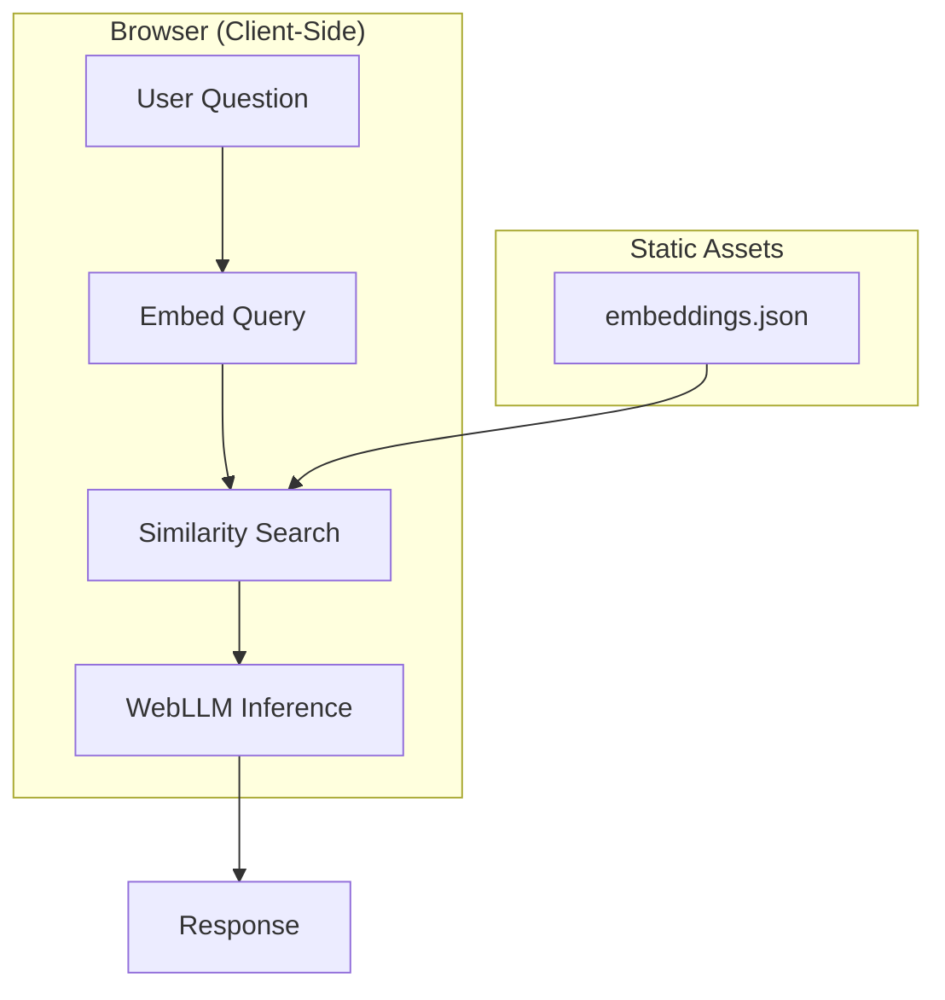

When I redesigned my portfolio site, I wanted to do something more interesting than the typical "About Me" page. What if visitors could have a conversation with an AI that actually *knows* about my projects? Not a generic chatbot, but one that could explain the architecture decisions I made in my Bitcoin Explorer, discuss why I chose certain libraries, or describe how my differential growth algorithm works.

The result is an AI assistant that runs entirely in your browser, requires no API keys, and genuinely understands my work. Here's how I built it.

## The Challenge

Most AI chatbots fall into two categories:

1. **Generic LLMs** that know nothing about you specifically
2. **RAG systems** that require expensive server infrastructure

I wanted the best of both worlds: an AI that knows my projects intimately, but runs client-side with zero hosting costs. The solution combines three technologies: WebLLM for browser-based inference, semantic embeddings for knowledge retrieval, and a carefully structured documentation system.

## Architecture Overview

The system has two main phases:

**Build Time (Server-Side)**
1. Fetch project documentation from my GitHub repos
2. Chunk the markdown into semantic sections
3. Generate embeddings using a sentence transformer
4. Store the embeddings as a static JSON file

**Runtime (Browser)**
1. User asks a question
2. Embed the question using the same model
3. Find the most relevant documentation chunks via cosine similarity
4. Inject that context into the LLM prompt
5. Generate a response using WebLLM

## WebLLM: Running LLMs in the Browser

[WebLLM](https://github.com/mlc-ai/web-llm) is remarkable. It uses WebGPU to run large language models directly in your browser with near-native performance. I'm using Llama 3.2 3B, which offers a good balance between capability and download size.

```typescript
import { CreateMLCEngine } from '@mlc-ai/web-llm';

const engine = await CreateMLCEngine(
  'Llama-3.2-3B-Instruct-q4f16_1-MLC',
  { initProgressCallback: (report) => setLoadingProgress(report.text) }
);
```

The first load downloads ~1.5GB of model weights, but they're cached in IndexedDB for subsequent visits. After that, the model loads in seconds.

The key advantage? **Zero API costs, zero rate limits, complete privacy.** The conversation never leaves your device.

## The RAG System: Teaching the AI About My Projects

RAG (Retrieval-Augmented Generation) is the secret sauce. Instead of fine-tuning the model on my projects (expensive and impractical), I retrieve relevant documentation at query time and inject it into the context.

### Step 1: Structured Documentation

Each of my projects contains a `prompts/` folder with three markdown files:

- **architecture.md** - System diagrams, design decisions, component overview
- **stack.md** - Technology choices, libraries, why I picked them
- **qa.md** - Anticipated questions and detailed answers

This structure is crucial. The AI doesn't just know *what* technologies I used—it knows *why* I chose them.

### Step 2: Chunking

Raw markdown files are too large and unfocused for retrieval. I break them into semantic chunks:

```typescript
function chunkMarkdown(content: string, maxChunkSize = 1500): Chunk[] {
  const sections = content.split(/^## /gm);

  return sections.flatMap(section => {
    if (section.length <= maxChunkSize) {
      return [{ content: section, type: 'section' }];
    }
    // Split large sections by paragraphs
    return splitByParagraphs(section, maxChunkSize);
  });
}
```

Each chunk is small enough to fit in the context window but large enough to contain meaningful information.

### Step 3: Embeddings

Here's where the magic happens. I convert each chunk into a 384-dimensional vector using `all-MiniLM-L6-v2`:

```typescript
import { pipeline } from '@xenova/transformers';

const embedder = await pipeline('feature-extraction', 'Xenova/all-MiniLM-L6-v2');

const embedding = await embedder(chunkText, {
  pooling: 'mean',
  normalize: true,
});
```

These vectors capture the *semantic meaning* of the text. Similar concepts cluster together in vector space, even if they use different words.

At build time, I generate embeddings for all 887 chunks across 17 projects and save them to a static JSON file (~15MB).

### Step 4: Retrieval

When you ask a question, I embed it using the same model and find the closest chunks via cosine similarity:

```typescript
function cosineSimilarity(a: number[], b: number[]): number {
  let dot = 0, normA = 0, normB = 0;
  for (let i = 0; i < a.length; i++) {
    dot += a[i] * b[i];
    normA += a[i] * a[i];
    normB += b[i] * b[i];
  }
  return dot / (Math.sqrt(normA) * Math.sqrt(normB));
}

const results = chunks
  .map(chunk => ({ chunk, score: cosineSimilarity(queryEmbedding, chunk.embedding) }))
  .filter(r => r.score >= 0.25)
  .sort((a, b) => b.score - a.score)
  .slice(0, 5);
```

The top 5 most relevant chunks get injected into the system prompt, giving the LLM specific context to answer from.

## The System Prompt

The prompt engineering is critical. I explicitly instruct the model to:

1. Use the provided context to answer questions
2. Quote specific details from the documentation
3. Never claim ignorance when the answer is in the context

```typescript
const SYSTEM_PROMPT = `You are Jacob Kanfer's AI assistant.
Answer questions about Jacob and his projects using the context provided.

IMPORTANT: When context is provided, USE IT to give detailed answers.
Quote specific details from the context (frameworks, features, decisions).
Don't say "I don't have information" if the context contains the answer.

${ragContext}
`;
```

## Mermaid Diagrams for Architecture Visualization

Many of my project documents include Mermaid diagrams. These render as interactive flowcharts, sequence diagrams, and architecture overviews on the case study pages.



I customized the Mermaid theme to match my site's dark aesthetic, with zoom controls for detailed diagrams:

```typescript
mermaid.initialize({
  theme: 'dark',
  themeVariables: {
    primaryColor: '#2d4a4a',
    primaryTextColor: '#ffffff',
    nodeBkg: '#1a2e2e',
    nodeTextColor: '#ffffff',
    clusterBkg: '#1a1a2e',
  },
});
```

## Results and Lessons Learned

After building this system, here's what I've learned:

**What Works Well:**
- The AI gives genuinely informed answers about my projects
- Browser-based inference means zero ongoing costs
- The documentation structure forces me to think clearly about my architectural decisions
- Visitors engage more deeply with projects they're curious about

**Challenges:**
- WebGPU isn't supported everywhere (Chrome 113+ required)
- Initial model download is 1.5GB (though cached afterward)
- Embedding 887 chunks takes ~60 seconds at build time
- The 3B model occasionally hallucinates despite having context

**Future Improvements:**
- Stream responses for better UX
- Add source citations to responses
- Explore smaller, faster models as they become available
- Consider hybrid approach with server fallback for unsupported browsers

## Try It Yourself

Head to the [Chat](/chat) page and ask the AI anything about my projects. Try questions like:

- "How does BTC Explorer fetch blockchain data?"
- "What state management does the Differential Growth project use?"
- "Why did you choose WebLLM over an API-based solution?"

The AI will retrieve relevant documentation and give you a detailed, accurate answer—all running locally in your browser.

---

*The full source code for this site, including the RAG system, is available on [GitHub](https://github.com/Technical-1/All-About-Me).*
