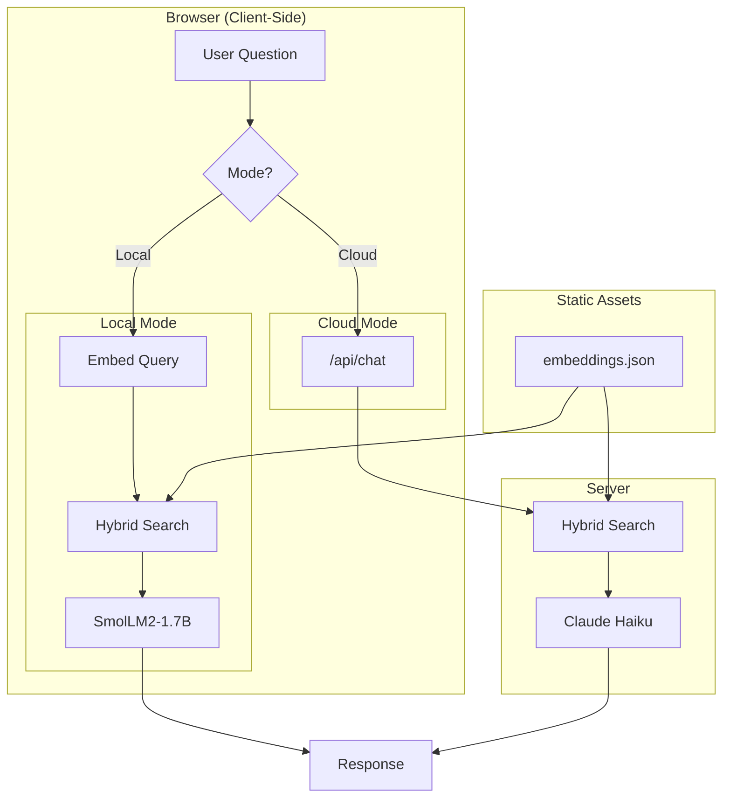

When I redesigned my portfolio site, I wanted to do something more interesting than the typical "About Me" page. What if visitors could have a conversation with an AI that actually *knows* about my projects? Not a generic chatbot, but one that could explain the architecture decisions I made in my Bitcoin Explorer, discuss why I chose certain libraries, or describe how my differential growth algorithm works.

The result is an AI assistant that genuinely understands my work—with two modes: a **local mode** that runs entirely in your browser using WebLLM, and a **cloud mode** powered by Claude Haiku for browsers without WebGPU support. Here's how I built it.

## The Challenge

Most AI chatbots fall into two categories:

1. **Generic LLMs** that know nothing about you specifically
2. **RAG systems** that require expensive server infrastructure

I wanted the best of both worlds: an AI that knows my projects intimately, with the flexibility to run either client-side (zero costs) or via a lightweight cloud API (for unsupported browsers). The solution combines four technologies: WebLLM for browser-based inference, Claude Haiku for cloud fallback, semantic embeddings for knowledge retrieval, and a hybrid search system that combines semantic similarity with keyword matching.

## Architecture Overview

The system has two main phases:

**Build Time (Server-Side)**
1. Fetch project documentation from my GitHub repos
2. Chunk the markdown into semantic sections
3. Generate embeddings using a sentence transformer
4. Store the embeddings as a static JSON file

**Runtime (Two Modes)**

*Local Mode (WebLLM):*
1. User asks a question
2. Embed the question using the same model (runs in browser)
3. Find the most relevant documentation via hybrid search
4. Inject that context into the LLM prompt
5. Generate a response using WebLLM (SmolLM2-1.7B)

*Cloud Mode (Claude Haiku):*
1. User asks a question
2. Send query to server API endpoint
3. Server performs hybrid search on embeddings
4. Inject context into Claude Haiku prompt
5. Return response to client

The system automatically detects WebGPU support on page load. If your browser supports it, you get a toggle to switch between modes. If not, you're automatically placed in cloud mode with no confusing options shown.

Both modes support **streaming responses**—text appears word-by-word as it's generated, just like ChatGPT or Claude. This makes the experience feel responsive even before the full response is ready.

## WebLLM: Running LLMs in the Browser

[WebLLM](https://github.com/mlc-ai/web-llm) is remarkable. It uses WebGPU to run large language models directly in your browser with near-native performance. I'm using SmolLM2-1.7B, a compact but capable model that offers fast inference with a smaller download.

```typescript
import { CreateMLCEngine } from '@mlc-ai/web-llm';

const engine = await CreateMLCEngine(
  'SmolLM2-1.7B-Instruct-q4f16_1-MLC',
  { initProgressCallback: (report) => setLoadingProgress(report.text) }
);
```

The first load downloads ~800MB of model weights, but they're cached in IndexedDB for subsequent visits. After that, the model loads in seconds.

The key advantage? **Zero API costs, zero rate limits, complete privacy.** The conversation never leaves your device.

## Cloud Mode: Claude Haiku Fallback

Not everyone has WebGPU support (it requires Chrome 113+ or recent Edge). For these users, I added a cloud mode powered by Claude Haiku with streaming responses:

```typescript
// Request with streaming enabled
const response = await fetch('/api/chat', {
  method: 'POST',
  headers: { 'Content-Type': 'application/json' },
  body: JSON.stringify({ messages, stream: true }),
});

// Read the SSE stream
const reader = response.body.getReader();
while (true) {
  const { done, value } = await reader.read();
  if (done) break;
  // Parse and display each chunk as it arrives
  const chunk = decoder.decode(value);
  // Update UI with partial response...
}
```

The server uses Anthropic's streaming API to send text chunks as Server-Sent Events (SSE). Each chunk updates the UI immediately, so users see text appear word-by-word rather than waiting for the complete response.

To prevent abuse, the cloud endpoint includes rate limiting (20 requests per minute per IP) and input validation (message length limits, conversation size caps).

### Automatic Mode Detection

On page load, the chat checks for WebGPU support:

```typescript
useEffect(() => {
  checkWebGPUSupport().then(result => {
    setWebGPUSupported(result.supported);
    if (!result.supported) {
      setMode('cloud'); // Force cloud mode
    }
  });
}, []);
```

If WebGPU isn't available, users only see "Cloud Mode" in the header—no confusing toggle for a feature they can't use.

## The RAG System: Teaching the AI About My Projects

RAG (Retrieval-Augmented Generation) is the secret sauce. Instead of fine-tuning the model on my projects (expensive and impractical), I retrieve relevant documentation at query time and inject it into the context.

### Step 1: Structured Documentation

Each of my projects contains a `prompts/` folder with three markdown files:

- **architecture.md** - System diagrams, design decisions, component overview
- **stack.md** - Technology choices, libraries, why I picked them
- **qa.md** - Anticipated questions and detailed answers

This structure is crucial. The AI doesn't just know *what* technologies I used—it knows *why* I chose them.

### Step 2: Chunking

Raw markdown files are too large and unfocused for retrieval. I break them into semantic chunks:

```typescript
function chunkMarkdown(content: string, maxChunkSize = 1500): Chunk[] {
  const sections = content.split(/^## /gm);

  return sections.flatMap(section => {
    if (section.length <= maxChunkSize) {
      return [{ content: section, type: 'section' }];
    }
    // Split large sections by paragraphs
    return splitByParagraphs(section, maxChunkSize);
  });
}
```

Each chunk is small enough to fit in the context window but large enough to contain meaningful information.

### Step 3: Embeddings

Here's where the magic happens. I convert each chunk into a 384-dimensional vector using `all-MiniLM-L6-v2`:

```typescript
import { pipeline } from '@xenova/transformers';

const embedder = await pipeline('feature-extraction', 'Xenova/all-MiniLM-L6-v2');

const embedding = await embedder(chunkText, {
  pooling: 'mean',
  normalize: true,
});
```

These vectors capture the *semantic meaning* of the text. Similar concepts cluster together in vector space, even if they use different words.

At build time, I generate embeddings for all 887 chunks across 17 projects and save them to a static JSON file (~15MB).

### Step 4: Hybrid Retrieval

Pure semantic search has a weakness: it can miss exact matches. If someone asks about "BTC Explorer," semantic similarity might rank a chunk about "cryptocurrency wallets" higher than one that literally contains "BTC Explorer."

The solution is hybrid search—combining semantic similarity with keyword boosting:

```typescript
// First: semantic similarity ranking
const semanticResults = chunks
  .map(chunk => ({ chunk, score: cosineSimilarity(queryEmbedding, chunk.embedding) }))
  .filter(r => r.score >= 0.20)
  .sort((a, b) => b.score - a.score);

// Extract keywords from query (filter out stopwords)
const keywords = query.toLowerCase()
  .split(/\s+/)
  .filter(w => w.length > 2)
  .filter(w => !['the', 'and', 'for', 'what', 'how', 'about'].includes(w));

// Boost scores for chunks containing exact keywords
const boosted = semanticResults.map(r => {
  let keywordBoost = 0;
  for (const keyword of keywords) {
    if (r.chunk.content.toLowerCase().includes(keyword)) {
      // Stronger boost for longer keywords (likely project names)
      keywordBoost += keyword.length > 4 ? 0.15 : 0.08;
    }
  }
  return { ...r, score: Math.min(r.score + keywordBoost, 1.0) };
});
```

This hybrid approach ensures that when someone asks about a specific project by name, chunks from that project get prioritized—even if other chunks are semantically similar.

The top 8 most relevant chunks get injected into the system prompt, giving the LLM specific context to answer from.

## The System Prompt

The prompt engineering is critical. I explicitly instruct the model to:

1. Use the provided context to answer questions
2. Quote specific details from the documentation
3. Never claim ignorance when the answer is in the context

```typescript
const SYSTEM_PROMPT = `You are Jacob Kanfer's AI assistant.
Answer questions about Jacob and his projects using the context provided.

IMPORTANT: When context is provided, USE IT to give detailed answers.
Quote specific details from the context (frameworks, features, decisions).
Don't say "I don't have information" if the context contains the answer.

${ragContext}
`;
```

## Mermaid Diagrams for Architecture Visualization

Many of my project documents include Mermaid diagrams. These render as interactive flowcharts, sequence diagrams, and architecture overviews on the case study pages.



I customized the Mermaid theme to match my site's dark aesthetic, with zoom controls for detailed diagrams:

```typescript
mermaid.initialize({
  theme: 'dark',
  themeVariables: {
    primaryColor: '#2d4a4a',
    primaryTextColor: '#ffffff',
    nodeBkg: '#1a2e2e',
    nodeTextColor: '#ffffff',
    clusterBkg: '#1a1a2e',
  },
});
```

## Results and Lessons Learned

After building and iterating on this system, here's what I've learned:

**What Works Well:**
- The AI gives genuinely informed answers about my projects
- Local mode means zero ongoing costs for most users
- Cloud fallback ensures everyone gets a good experience
- Streaming responses make both modes feel snappy and responsive
- Automatic WebGPU detection means users never see broken features
- Hybrid search catches both semantic matches and exact keyword matches
- The documentation structure forces me to think clearly about my architectural decisions

**Challenges:**
- WebGPU browser support is improving but not universal
- Initial model download is ~800MB (cached afterward)
- Embedding 950+ chunks takes ~60 seconds at build time
- Balancing model size vs. capability (switched from 3B to 1.7B for faster loads)

**What I'd Do Differently:**
- Start with hybrid search from the beginning—pure semantic search missed obvious matches
- The cloud fallback should have been built earlier, not as an afterthought

## Try It Yourself

Head to the [Chat](/chat) page and ask the AI anything about my projects. Try questions like:

- "How does BTC Explorer fetch blockchain data?"
- "What state management does the Differential Growth project use?"
- "Tell me about Jacob's experience with TypeScript"

The AI will retrieve relevant documentation and give you a detailed, accurate answer. If your browser supports WebGPU, it runs entirely locally. Otherwise, it seamlessly falls back to the cloud API.

---

*The full source code for this site, including the RAG system, is available on [GitHub](https://github.com/Technical-1/All-About-Me).*
